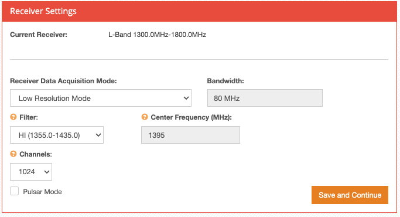

####################
20m observations 101
####################

Observations with the 20m Telescope are carried out remotely using Skynet. 

Log in to Skynet
================

Go to https://skynet.unc.edu/radio_obs.

You will see this welcome page

Login with your group/account credentials. Once you're logged in, make sure you're in the **My Observatory > Radio Observing** section of the website. 

Start a new observation
=======================

Click on **Add New Observation** in the top right panel.

Setting up your observations
----------------------------

Setting up new observations is a four step process. You have to 

#. Select your target source.
#. Setup the receiver.
#. Select the Path.
#. Review your selection.

1. Select your Target Source
----------------------------

You can specify your target source in three different ways: 

* Type in your target in the **Target Lookup** box (2nd box from the top on the right) and click **Search**. 
* Click on your target in the skyviewer. 
* Specify the coordinates in the box below the skyviewer.

.. note:: 

   When you specify the Observation Name, include your group number. This will facilitate finding the observations later. 

At the bottom of the page you can see an elevation plot, which tells you when your selected target is observable with the Green Bank 20m telescope. 

.. note:: 
 
   * Minimum elevation: 
        * Use a minimum elevation higher than the default 5 degrees as there are objects surrounding the telescop ethat may block the beam path.
        * Use a minimum elevation of 25 degrees for maps. 
   * Sun avoidance:
        * The 20m can pick up radiation from the Sun in the far sidelobes.
        * To avoid this, keep all parts of a map at least 15 degrees away from the Sun.  

Finally click the orange **Save and Continue** button to contiue to the next setup step. 

2. Setup the Receiver
---------------------

The next page shows you the current receiver and allows you to set additional receiver parameters.

Most of the time the L-Band receiver will be installed. For that one you can choose between 2 resolution modes:

* Low Resolution Mode
* High Resolution Mode

Low Resolution Mode
^^^^^^^^^^^^^^^^^^^

This mode allows you four filter choices:

* HI: (1355 - 1435) MHz
* OH2: (1650 - 1750) MHz
* OH1: (1630 - 1730) MHz
* All: (1350 - 1750) MHz

The channel width is 0.488 MHz. 

.. note:: 

   To activate **Pulsar Mode**, select the All filter as well as the box saying Pulsar Mode. 

.. note:: 

   Bandwidth, Center Frequency, and Number of Channels are pre-set in the Low Resolution Mode. 

.. warning:: 

   Beware of RFI in the (1550 - 1610) MHz range.

High Resolution Mode
^^^^^^^^^^^^^^^^^^^^

This mode allows you to specify two spectral windows (**Center Frequency (MHz)** and **Secondary Frequency (MHz)**).

.. warning::

   The separation between the two spectral windows may not be larger than 480 MHz.

You can choose the number of channels (1024, 2048, 4096, 8192, 16384). This gives you the following channel widths at 21 cm: 

.. list-table:: High Resolution Mode at 21 cm
   :widths: 25 30 30
   :header-rows: 1

   * - Number of Channels
     - Channel width in frequency
     - Channel width in velocity
   * - 1024
     - 15.26 kHz
     - 3.22 km/s
   * - 2048
     - 7.63 kHz
     - 1.61 km/s
   * - 4096
     - 3.81 kHz
     - 0.81 km/s
   * - 8192
     - 1.91 kHz
     - 0.40 km/s
   * - 16384
     - 0.95 kHz
     - 0.20 km/s

.. note:: 

   * The bandwidth is fixed at 15.625 MHz

Finally click the orange **Save and Continue** button to contiue to the next setup step. 

3. Select the Path
------------------

In the top of the next window you will see information on the **Time Account**. This lets you know how much credits you have available for your observations. One credit point corresponds to 1 second of observing time. 

Then you have four different choices to define the telescope path in the section **Path Type**:

* Track
* OnOff
* Daisy
* Map

Track 
^^^^^

- The telescope observes one point on the sky. 
- This mode is ideal for observing spectral lines and pulsars

- **Spectral lines**:
    - typically set the integration time to 1s
- **pulsars**:
    - use 1/100th of the pulse period for the integration time
        .. warning::

            The minimum integration period for pulsars is 0.00013s.

    - the sample time is :math:`2^n\left(\frac{1024}{5\times 10^8}\right)`
        - the maximum allowed in the software is n=11 or sample=4.19s
    - for shorter integration times, the system will set sampling to the closest power of two submultiple, e.g. with :math:`T_{int} = 0.0001s`, you will get 1.05 ms. 

Once you provide all required input, you will see the total time estimate and corresponding credits. 

OnOff
^^^^^

- If you're doing continuum observations, this mode is good for measuring the flux density of an object.
- If you're doing spectral line observations, this mode is good for observing fainter objects.
- Duration (30 - 60)s or (200 - 300) s for hydrogen in nearby galaxies.
- Set the offset to a few beamwidths. You can set the offset in a combination of *RA|Lng|Az* and *Dec|Lat|El*.

Once you provide all required input, you will see the total time estimate and corresponding credits. 

Daisy
^^^^^

- Radius: 
    - (90 - 120) arcmin
- Number of petals:
    - use 4 for a quicklook
    - use 8 - 12 for a more complete map
- Integration time: 
    - 0.2s or 0.3s is usually good. 
- Duration: 
    - 180 s for 4 petals
    - 360 s for 8 petals 

Once you provide all required input, you will see the total time estimate and corresponding credits. 

Map
^^^

.. image:: material/12_skynet_addObs_path_map.png
    :scale: 80%

- Raster Scans
    - RALongMap: 
        - sweep along the Right Ascension direction and step in Declination
    - DecLatMap: 
        - sweep along the Declination direction and step in Right Ascension

- Map size:
    - specified in two ways **Beam Widths** or **Degrees**
    - maps should be at least 5 beam widths across, i.e. no smaller than 4x4 degrees (L-band beam is ~44 arcmin)

- Gaps between sweeps:
    - for quickor large maps: 1/4 or 1/3
    - for more detailed maps: 1/5 or 1/10
- Gap along sweeps:
    - keep this box checked
- Map depth:
    - do not increase to more than 2 seconds

- Total map time:
    - try to keep maps to 30min
    - it is more efficient to make several smaller maps
    

Once you provide all required input, you will see the total time estimate and corresponding credits. 
   

Finally click the orange **Save and Continue** button to contiue to the next setup step. 

4. Review your Selection
------------------------

When you have reviewed your selection and you are happy with all your settings, click the orange **Submit** button.
